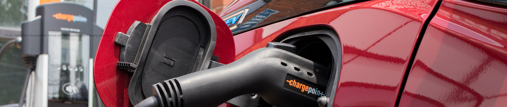

# Project-3-Carbon Emissions Predictor
## IMPACT OF ELECTRIFYING TRANSPORTATION IN THE UNITED STATES

This project uses machine learning to determine the predictability of reducing carbon emissions in the transportation sector by replacing internal combustion engine vehicles with electric vehicles (EV).

## -----link to GitHub Pages goes here-----
---

## Project Team
* Nick Buller: <a href="https://github.com/nbullerds" target="_blank">github.com/nbullerds</a>, <a href="mailto:nabuller@gmail.com">nabuller@gmail.com</a>
* Kerry Harp: <a href="https://github.com/klharp" target="_blank">github.com/klharp</a>, <a href="mailto:kharp@umn.edu">kharp@umn.edu</a>
* Matt Killeen: <a href="https://github.com/matthewkilleen0830" target="_blank">github.com/matthewkilleen0830</a>, <a href="matthew.killeen0830@gmail.com">matthew.killeen0830@gmail.com</a>
* Ciera Morris: <a href="https://github.com/cieranmorris" target="_blank">github.com/cieranmorris</a>, <a href="mailto:cieranmorris@gmail.com">cieranmorris@gmail.com</a>

---

## Overview

Transportation makes up 29% of the total U.S. greenhouse gas emissions. In April of 2021, President Biden announced a target of 50-52% reduction in emissions from the 2005 levels. Can the transition away from internal combustion vehicle types help to reduce these emissions in the United States?

<!-- Governmental and NGO policies during the Covid-19 pandemic changed human behavior resulting in decreased energy demand. At the peak in April of 2020, daily global CO2 emissions decrease 19% compared to 2019. -->

Data from various sources was used to test-train a dataset to determine the predictability of reducing carbon emission in the transportation sector.

Assumptions:
* GHG emissions recorded in MtCO2e (metric tons CO2 equivalent) and does not take into account changes in atmospheric levels of greenhouse gases attributed to forest and land-use activities.
  
* The future EVs will use energy from renewable sources (solar and wind) and not from coal- or gas-fired energy generation.

* Does not take into account the effects of emissions, manufacturing, or lifecycle issues of EV batteries.

## -----screen shot of web page goes here-----

---
## Process
This project showcases using machine learning to make a predictions and uses visualizations to provide the user  an interactive means to explore the data.

The project methodology focused on:
* Working as a team, demonstrated by using branches in GitHub to manage the push/merge/pull of the repository, acquiring datasets, coordinating efforts to develop the machine learning model, and preparing information for display/presentation.

* Acquiring the datasets from multiple sources.

* ETL of chosen datasets.

* Developing a machine learning model using multi-linear regressions to predict an outcome.
    *  Fitting the model

    * Tuning the model

* Creating visualizations used to demonstrate the project's intent.

* Creating a website and deploying to GitHub Pages.

* Languages and libraries used:
    * Python
    * Pandas
    * Numpy
    * Matplotlib
    * scikit-learn
    * HTML
    * CSS
    * Bootstrap
    * D3
    * Javascript
    * Plotly
    * Leaflet
    * Tableau

---