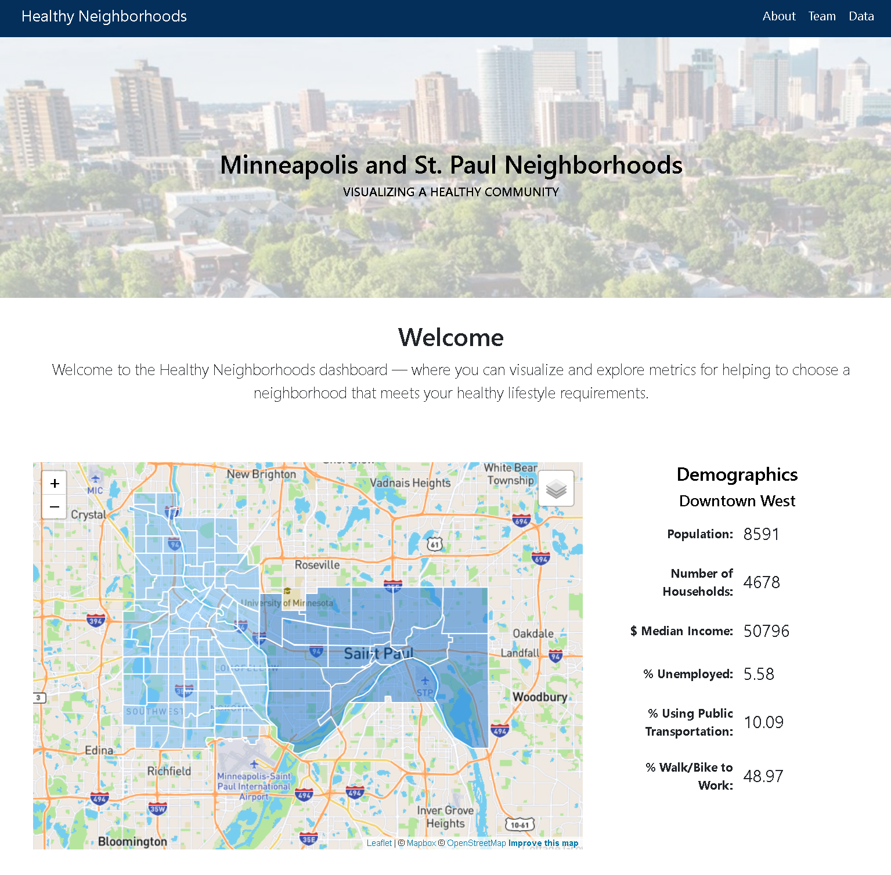

# Project-3-Carbon Emissions Predictor

This dashboard demonstrates how to integrate Flask with HTML and JavaScript code. This project will note run on LiveServer, a Flask server must be used.

need to change image when site is more complete

---

## Overview
text

text

text

text

## Project Team
* Nick Buller
* Kerry Harp
* Matt Killeen
* Ciera Morris
